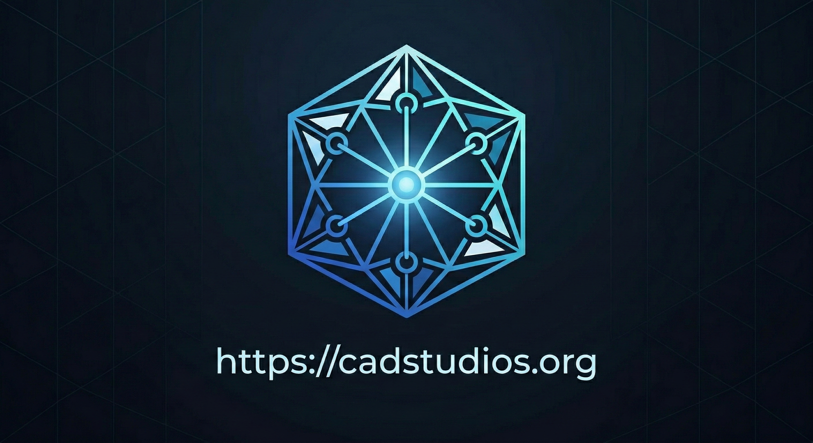

# 🤖 build123d CAD Code Generator

A **Multi-Agent Orchestrator** for autonomous parametric CAD code generation using [build123d](https://build123d.readthedocs.io/).

Project landing page: [https://cadstudios.org/](https://cadstudios.org/)

## What It Does

Give it a natural language objective:

```bash
build123d_cad "Create a parametric flange with 8 bolt holes, configurable diameter and thickness"
```

## Brief Team

This company wasn't developed in a slow, corporate R&D vacuum. The founding team behind CAD Studios coalesced at the high-stakes Mistral Paris Hackathon, where the VibeCAD engine was originally born.

- **Hamze Ghalebi**  
  *Senior Technical Product Manager, AI Infrastructure & Rust*  
  Senior technical product manager with C-level operating experience scaling complex AI platforms across Europe, with direct ownership of the VibeCAD Rust core roadmap and architecture execution.  
  Paris, France

- **Arshia Afzal**  
  *LLM Architecture & Optimization*  
  PhD researcher at EPFL specializing in efficient LLM architectures. Bridges deep learning theory with real-world systems performance.  
  Lausanne, Switzerland

- **Anthony Eid**  
  *Systems Engineering & Tooling*  
  Software developer at Zed Industries with deep Rust expertise. Previously defended the software ecosystem at GitHub for nearly a decade.  
  Michigan, USA

- **Joosep Pata**  
  *ML/AI Research & Engineering*  
  PhD from ETH Zurich, CMS Thesis Prize recipient. Applies machine learning to high-energy physics at KBFI, bringing rigorous scientific methodology to CAD generation.  
  Tallinn, Estonia

## Iteration Notes (Hackathon Learnings)

We tested two major directions before locking the current execution path:

- **Fine-tuning path (attempted):** We explored a fine-tuning approach for speed/consistency, but it did not produce enough measurable value for the time and compute budget available during the hackathon. We dropped it in favor of stronger orchestration prompts, better review gates, and iterative tool-driven corrections.
- **Fine-tuning archive artifact:** The fine-tuning branch and related experiments are preserved as an archive at [github.com/hghalebi/vibecad](https://github.com/hghalebi/vibecad) for historical reference and future evaluation.
- **Zed-style IDE path:** The Zed-style IDE flow works and those artifacts remain available in our project history, but the core product now focuses on the automated agentic loop. The default path is now auto-generation with review + self-correction, which is what we consider the primary production approach.

## Knowledge Persistence and Policy Governance

The agent loop is designed to learn fast **and** stay boringly consistent. It uses web search only as a bounded input source, then turns validated findings into internal knowledge for future runs.

### Web Learning Workflow

1. **Discover**: use `WebSearcher` for focused retrieval when external references are needed.
2. **Validate**: keep primary sources, drop low-confidence claims, and avoid copy-paste shortcuts.
3. **Summarize**: convert findings into concise implementation notes and clear decision rationale.
4. **Persist**: save accepted learnings through `LearnKnowledge`.
5. **Store**: place approved notes under `docs/knowledge/learned/` and link from related task notes.

### Persistence rules

- Persist metadata, source URL, and context for traceability.
- Persist confidence signals, validation notes, and any identified risks.
- Do not persist secrets, API keys, or private user information.
- Prefer internal documentation when existing guidance already covers the same topic.
- Re-review stale entries and refresh/retire anything older than 90 days without revalidation.

### OpenTelemetry-to-Policy Pipeline

Operational telemetry is used to improve governance, not to create accidental policy surprises.

#### Inputs to track

- objective/context identifiers
- tool lifecycle events (`requested`, `failed`, `retried`)
- warning/error counts
- run duration and resource usage
- approval gates and manual blocks

#### Data governance

- Hash or remove PII and secrets before export.
- Keep raw prompts off the default export path; retain structured aggregates by default.
- Default retention: 30 days raw, with longer retention only for aggregated metrics.

#### Policy refresh process

1. Aggregate spans daily by job type and tool.
2. Detect recurring warnings/failures.
3. Draft proposed policy updates as reviewed entries under `docs/knowledge/learned/`.
4. Require manual review before any change is promoted.
5. Untagged suggestions stay as suggestions until an owner approves implementation.

The system dispatches **7 specialized AI agents** through a 4-gate quality review pipeline to produce production-ready `build123d` Python scripts, auto-executes them via `uv`, and opens an **interactive 3D viewer** in your browser.

## Architecture

```
┌─────────────┐     ┌────────────┐     ┌─────────┐
│  Supervisor  │────▶│ Researcher │────▶│  Coder  │
│  (Router)    │     │ (WebSearch)│     │(build123d)│
└──────────────┘     └────────────┘     └────┬────┘
       ▲                                      │
       │              Quality Pipeline        ▼
       │         ┌─────────────────────────────┐
       │         │ Reviewer → PhysicsReviewer  │
       │         │ → IntentReviewer            │
       └─────────│ → ComplianceReviewer (Gate) │
                 └─────────────────────────────┘
                              │
                              ▼
                   ┌─────────────────┐
                   │ Auto-Execution  │
                   │ (uv run python3)│
                   └────────┬────────┘
                            ▼
                   ┌─────────────────┐
                   │  3D Viewer      │
                   │ (Three.js HTML) │
                   └─────────────────┘
```

### Agent Roles

| Agent | Role | Tools |
|-------|------|-------|
| **Supervisor** | Routes tasks, holds final authority | — |
| **Researcher** | Gathers info via WebSearcher + KnowledgeBase | 📚 🧠 🛠️ |
| **Coder** | Writes build123d Python scripts | 📚 🧠 🛠️ 🔍 ✏️ 🐍 |
| **Reviewer** | Code quality + API correctness | 📚 🧠 🛠️ 🔍 🐍 |
| **PhysicsReviewer** | Geometry, topology, dimensional accuracy | 📚 🧠 🛠️ 🐍 |
| **IntentReviewer** | Verifies user intent is fully met | 📚 🧠 🛠️ 🐍 |
| **ComplianceReviewer** | EU regulatory compliance (CE, ATEX, PED) — **Final Gate** | 📚 🧠 🛠️ 🐍 |

**Legend:** 📚 KnowledgeBase · 🧠 LearnKnowledge · 🛠️ WebSearcher · 🔍 CodeSnippetSearch · ✏️ CodeSnippetReplace · 🐍 LinterTool

### Agent Tools

| Tool | Purpose |
|------|---------|
| **KnowledgeBase** | Read agent-specific domain expertise |
| **LearnKnowledge** | Save new insights for future runs |
| **WebSearcher** | Search the web via serper.dev |
| **ExampleSearcher** | Search build123d example corpus |
| **CodeSnippetSearch** | Find patterns in generated code |
| **CodeSnippetReplace** | Atomic search-and-replace on generated code |
| **LinterTool** | Validate Python syntax before approval |

## Prerequisites

- **Rust** (stable toolchain, edition 2024)
- **Python 3.9+** with `build123d` (`uv` handles this automatically)
- **uv** — Python package manager ([install](https://docs.astral.sh/uv/))
- **Azure API Key** for Claude access
- **Serper API Key** for web search (optional)

## Environment Variables

```bash
export AZURE_API_KEY="your-key"
export AZURE_EXISTING_AIPROJECT_ENDPOINT="your-endpoint"
export AZURE_MODEL="claude-opus-4-5"  # optional, defaults to claude-opus-4-5
export SERPER_API_KEY="your-serper-key"  # optional, for WebSearcher
export AGENTIC_MAX_STEPS=25  # optional, loop cap
export WEB_SEARCH_TIMEOUT_SECS=15  # optional, web search timeout in seconds
```

### Provider model

This repository intentionally uses **Anthropic models via Azure MaaS** only, with a stable and auditable runtime profile.

### Local env loading

`cargo run` automatically loads `.env` now via startup telemetry bootstrap:

```bash
# from this folder
cp .env.example .env
cargo run -- "Create a parametric flange with 6 bolt holes"

# .env can also live in a parent directory and will be auto-discovered.
```

The docs and examples in this repository are written against the active agentic stack above.
If you use external references, align them to this repository’s provider setup before adapting.

## Observability (OpenTelemetry + SigNoz)

This project now emits structured traces for:

- request root spans (`rig_build123d_request`)
- orchestration phases (`agent_orchestrator`, `agent_turn`)
- tool execution (`tool.*`, e.g. `tool.web_search`, `tool.code_snippet_replace`)
- strict GenAI metadata fields on agent spans (`gen_ai_provider_name`, `gen_ai_system`, `gen_ai_operation_name`, `gen_ai_request_model`, `gen_ai_error_type`)

### OTLP setup (SigNoz Cloud)

```bash
export OTEL_ENABLED=true
export OTEL_EXPORTER_OTLP_ENDPOINT="https://<region>.ingest.signoz.cloud:443"
export OTEL_SERVICE_NAME="build123d-cad"
export OTEL_EXPORTER_OTLP_PROTOCOL="grpc" # or http/protobuf, http/json
export OTEL_EXPORTER_OTLP_HEADERS="signoz-ingestion-key=<your-ingestion-key>"
export OTEL_EXPORTER_OTLP_COMPRESSION="gzip"
export OTEL_TRACES_SAMPLER_ARG="1.0"
export DEPLOYMENT_ENVIRONMENT="production"
```

You can also use SigNoz compatibility variable names:

```bash
export OTEL_ENABLED=true
export SIGNOZ_ENDPOINT="https://<region>.ingest.signoz.cloud:443"
export OTEL_SERVICE_NAME="build123d-cad"
export SIGNOZ_INGESTION_KEY="<ingestion-key>"
export OTEL_EXPORTER_OTLP_COMPRESSION="gzip"
export OTEL_TRACES_SAMPLER_ARG="1.0"
export DEPLOYMENT_ENVIRONMENT="production"
```

### OTLP setup (Local collector)

```bash
export OTEL_ENABLED=true
export OTEL_EXPORTER_OTLP_ENDPOINT="http://localhost:4317"
export OTEL_SERVICE_NAME="build123d-cad"
export OTEL_EXPORTER_OTLP_PROTOCOL="grpc" # or omit (default)
unset OTEL_EXPORTER_OTLP_HEADERS
export OTEL_TRACES_SAMPLER_ARG="1.0"
```

All entrypoints now default to the same service name so telemetry appears in one
service panel in SigNoz by default:

- CLI run: `cargo run -- "..."`  
- Agentic example: `cargo run --example agentic_workflow`  
- Smoke check: `cargo run --example otel_smoke`

If you still want to split dashboards by entrypoint, set `OTEL_SERVICE_NAME` to
`build123d-cad-cli`, `build123d-cad-agentic`, or `build123d-cad-smoke` explicitly.

### Smoke check (collector path only)

```bash
OTEL_SMOKE_MARKER="manual-check" cargo run --example otel_smoke
```

The emitted span name is `otel_smoke_probe`.

## Quick Start

```bash
# 1. Install uv (if not already installed)
curl -LsSf https://astral.sh/uv/install.sh | sh

# 2. Build the project
cargo build --release

# 3. Run with an objective
cargo run -- "Create a parametric bearing housing with bolt pattern"

# 4. (Optional) Run the full agentic example with telemetry
cargo run --example agentic_workflow

# For short diagnostic runs (fast timeout on problematic web calls):
AGENTIC_MAX_STEPS=20 WEB_SEARCH_TIMEOUT_SECS=15 cargo run --example agentic_workflow
```

## Output

Generated scripts are saved to `.output/` with Git tracking:

```
.output/
└── my_project_20260228_150907/
    ├── .git/                          # Auto-initialized Git repo
    ├── step_0005_context.json         # Periodic context snapshot
    ├── step_0005_code.py              # Code at step 5
    ├── generated_script_*.py          # Final approved script
    ├── output.step                    # STEP file (CAD interchange)
    ├── output.stl                     # STL file (3D printing)
    └── viewer.html                    # Interactive 3D viewer (auto-opens)
```

### 3D Viewer

After successful execution, an **interactive Three.js viewer** auto-opens in your browser:
- Orbit controls (drag to rotate, scroll to zoom, right-click to pan)
- Metallic material with shadows on a dark grid
- Dimensions overlay (size in mm + triangle count)
- Fully self-contained HTML — no server needed

## Project Structure

```
src/
├── main.rs           # CLI entry point
├── lib.rs            # Library root
├── telemetry.rs      # OpenTelemetry + tracing bootstrap
├── viewer.rs         # Interactive 3D STL viewer (Three.js)
├── agentic/          # Multi-Agent Orchestrator
│   ├── agents/       # 7 specialized agents
│   ├── orchestrator.rs  # State machine + auto-execution (uv)
│   └── tools/        # Agent tools (KB, Web, CodeEditor, Linter)
├── infra.rs          # GitJournal, PythonLinter, Fabricator
├── errors.rs         # Error types
├── types.rs          # Core data structures
└── ...
docs/
└── knowledge/        # Agent expertise (markdown files)
```

## License

Strictly proprietary. This repository is **not licensed for any use** without explicit written permission from the copyright holder.
Any use, copy, modification, redistribution, reverse engineering, or derivative work is prohibited unless expressly authorized.

See [LICENSE](./LICENSE).
